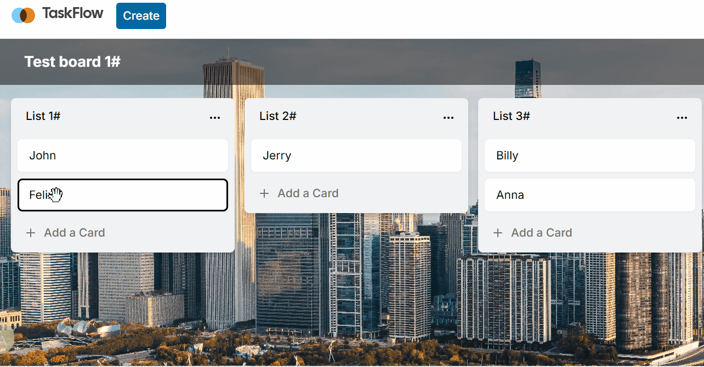
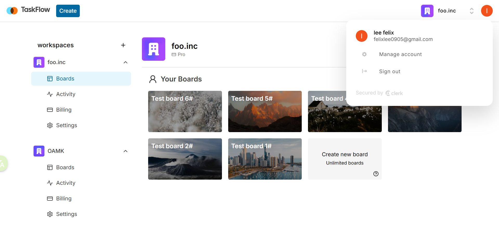
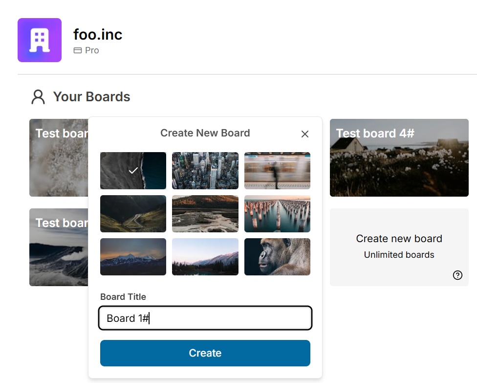
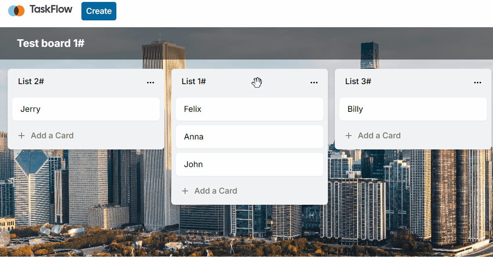
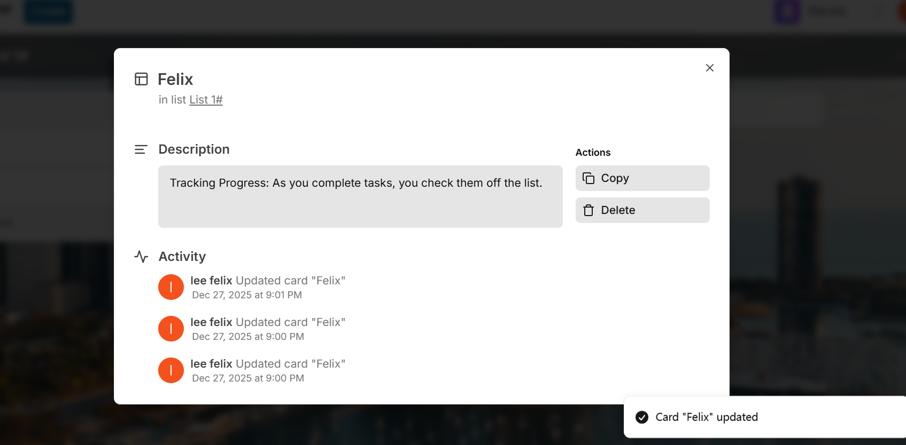
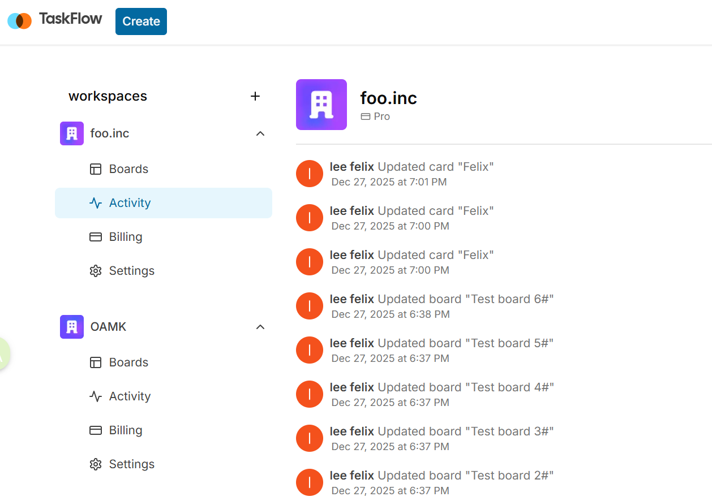
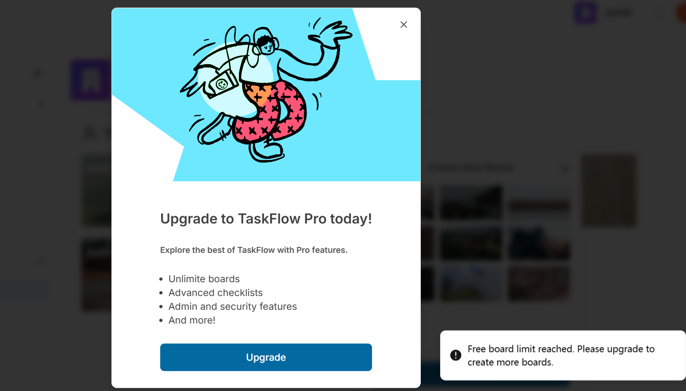
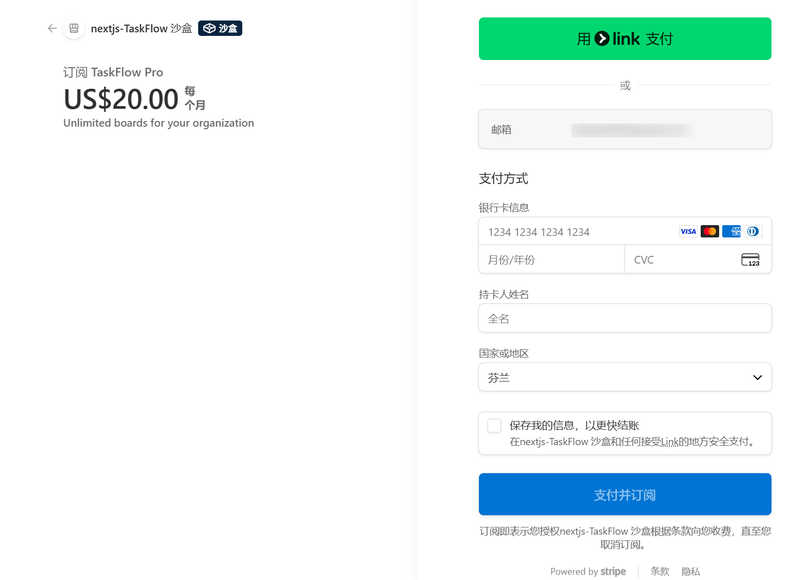

# 📝 TaskFlow ✅
<div align="center">

  <h3 align="center">A Fullstack Trello Clone</h3>

  <p align="center">
    Manage projects, track tasks, and collaborate with your team efficiently.
    <br />
    Built with Next.js 14, Server Actions, Prisma, Stripe, Tailwind, and more.
    <br />
    <br />
    <a href="https://nextjs-taskflow-app-iota.vercel.app/">Deloyed on vercel</a>
  </p>
</div>



## 📖 About The Project

**TaskFlow** is a modern task management application inspired by Trello. It allows users to create workspaces, boards, lists, and cards to organize their workflow. This project was built to demonstrate proficiency in modern full-stack web development using the Next.js ecosystem.

It features robust authentication, subscription management via Stripe, and an optimistic UI for a seamless user experience.

## ✨ Key Features

- **🔐 Authentication**: Secure user authentication using **Clerk** (Email, Google, Github).
- **🏢 Workspaces**: Create and manage multiple organizations/workspaces.
- **📋 Board Management**: Create, rename, and delete boards with Unsplash image integration.
- **🔄 Drag & Drop**: Smooth drag and drop functionality for Lists and Cards using `@hello-pangea/dnd`.
- **📝 Task Operations**: CRUD operations for Lists and Cards.
- **👁️ Activity Log**: Audit logs for every action performed within the board.
- **💳 Subscription System**: Stripe integration for Pro tiers (Unlimited boards).
- **⚡ Server Actions**: Utilizing Next.js Server Actions for direct database mutations.
- **🎨 Modern UI**: Built with **Tailwind CSS** and **Shadcn UI**.
- **🗄️ Database**: **MySQL** database managed via **Prisma ORM**.

## 🛠️ Tech Stack

- **Framework:** [Next.js 14](https://nextjs.org/) (App Router)
- **Language:** [TypeScript](https://www.typescriptlang.org/)
- **Styling:** [Tailwind CSS](https://tailwindcss.com/) & [Shadcn UI](https://ui.shadcn.com/)
- **Database:** [MySQL](https://www.mysql.com/) (hosted on PlanetScale/Neon/Local)
- **ORM:** [Prisma](https://www.prisma.io/)
- **Auth:** [Clerk](https://clerk.com/)
- **Payments:** [Stripe](https://stripe.com/)
- **State Management:** [Zustand](https://github.com/pmndrs/zustand)
- **Data Fetching:** [TanStack Query](https://tanstack.com/query/latest)

## 🚀 Getting Started

Follow these steps to set up the project locally.

### Prerequisites

Ensure you have the following installed:
- [Node.js](https://nodejs.org/) (v18 or higher)
- npm or pnpm or yarn

### Installation

1. **Clone the repository**
   ```bash
   git clone https://github.com/PengfeiLi-OAMK/nextjs-taskflow-app.git
   cd taskflow
   ```
2. **Install dependencies**
   ```bash
   npm install
   # or
   pnpm install
   ```
3. **Set up the database**
   Ensure your MySQL server is running or use a cloud provider like PlanetScale.
   ```bash
   npx prisma generate
   npx prisma db push
   ```
4. **Run the development server**
   ```bash
   npm run dev
   ```
Open http://localhost:3000 with your browser to see the result.

### Environment Variables

Create a .env file in the root directory and add the following variables:
```env
NEXT_PUBLIC_CLERK_PUBLISHABLE_KEY=...
CLERK_SECRET_KEY=...
NEXT_PUBLIC_CLERK_SIGN_IN_URL=/sign-in
NEXT_PUBLIC_CLERK_SIGN_UP_URL=/sign-up
NEXT_PUBLIC_CLERK_SIGN_IN_FALLBACK_REDIRECT_URL=/
NEXT_PUBLIC_CLERK_SIGN_UP_FALLBACK_REDIRECT_URL=/

DATABASE_URL=...
NEXT_PUBLIC_UNSPLASH_ACCESS_KEY=...
STRIPE_SECRET_KEY=...
NEXT_PUBLIC_APP_URL=http://localhost:3000
STRIPE_WEBHOOK_SECRET=...
```

## ✨Usage

- **Sign up/Login:** Create an account to get started.
- **Create Organization:** Set up your workspace.
- **Create Board:** Choose a background image and name your board.
- **Manage Tasks:** Add lists, cards, and drag them around to organize your workflow.
- **Upgrade:** Test the Stripe integration to upgrade your organization limits.

## 📸 Screenshots Gallery

### Workspace & Dashboard

### Board Operations

- **Creating Board**


- **Drag & Drop Logic**


### Card Details

- **Card Modal**
 

- **Activity Log**
 

### Pro Features & Billing

- **Upgrade to Pro**


- **Stripe Checkout**



